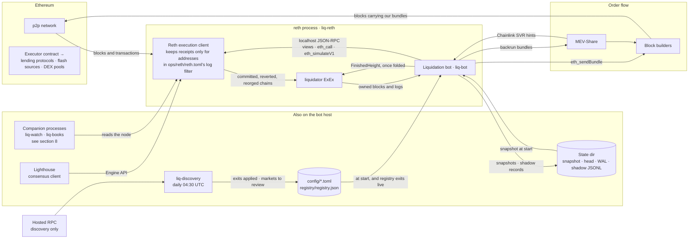
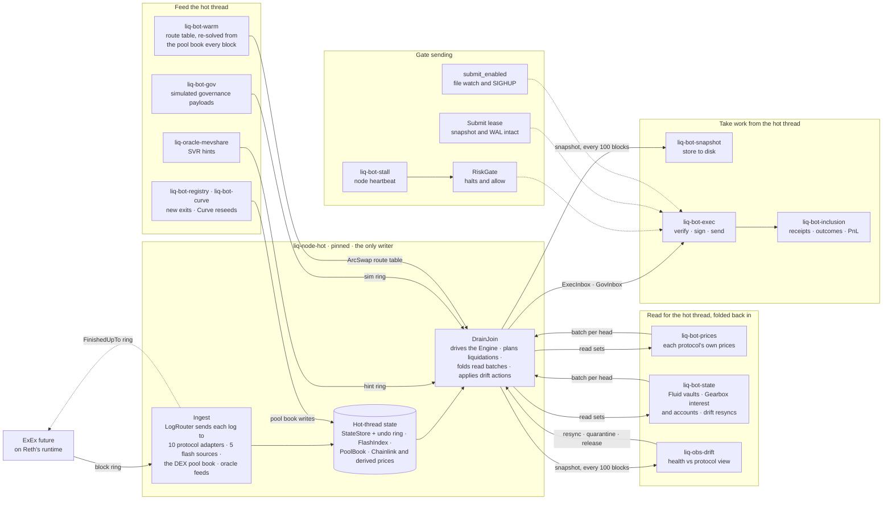
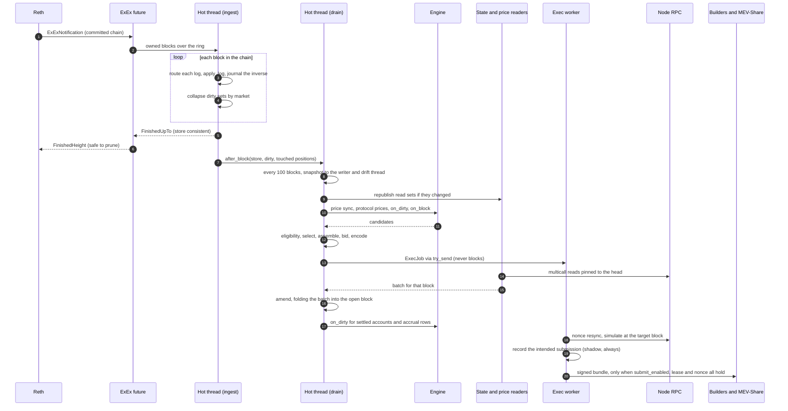
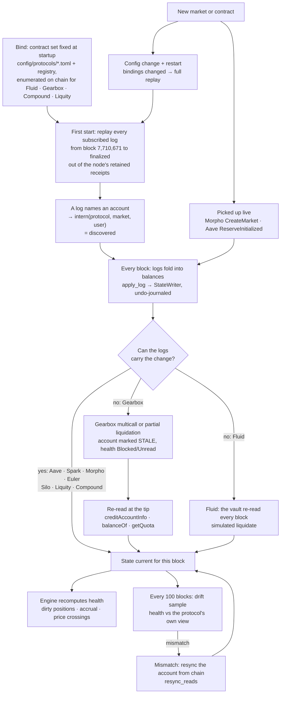
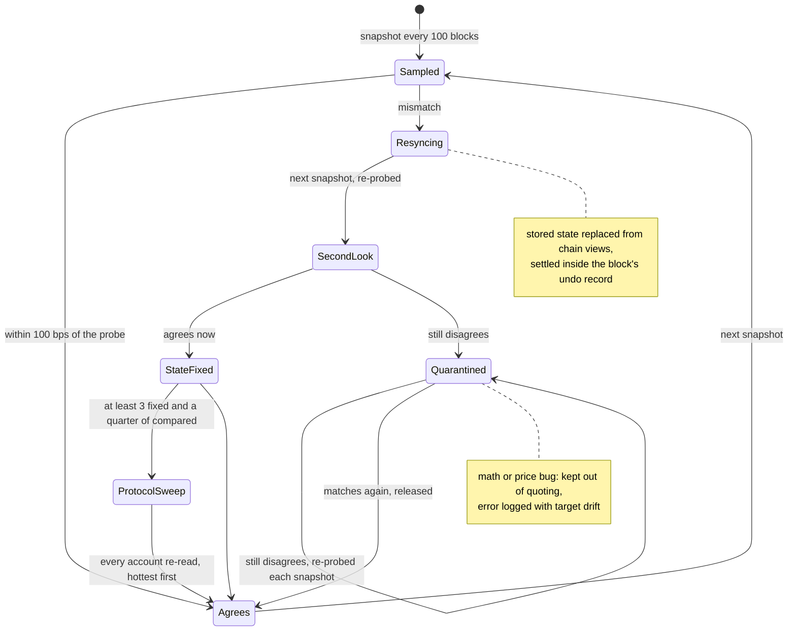
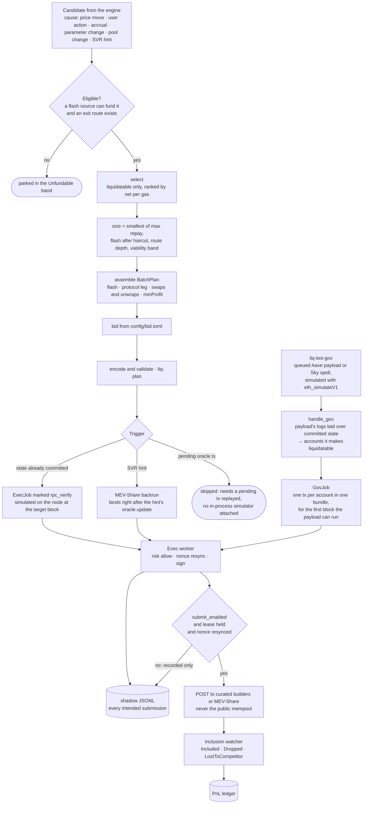
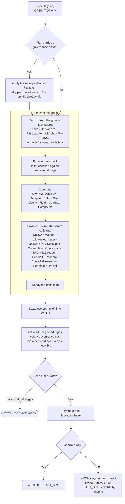
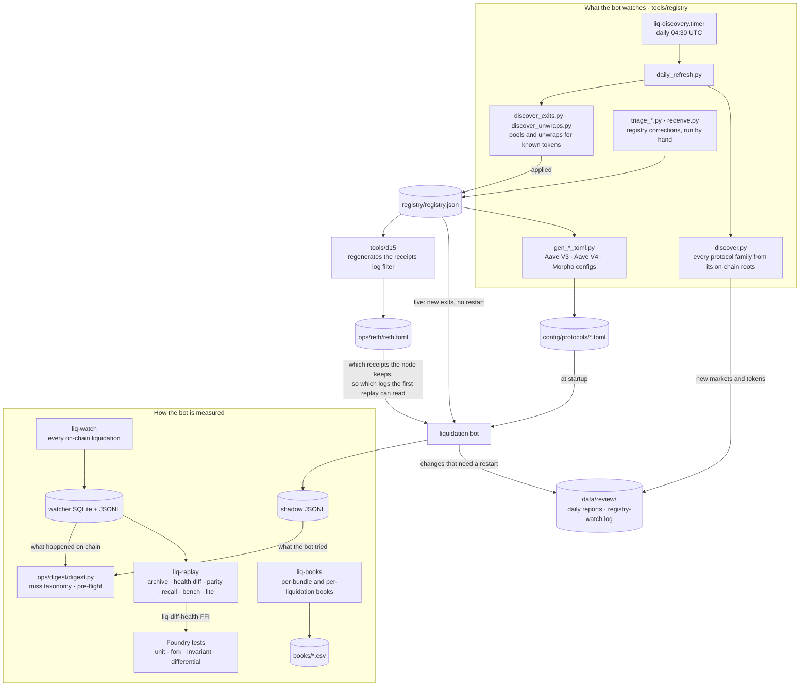
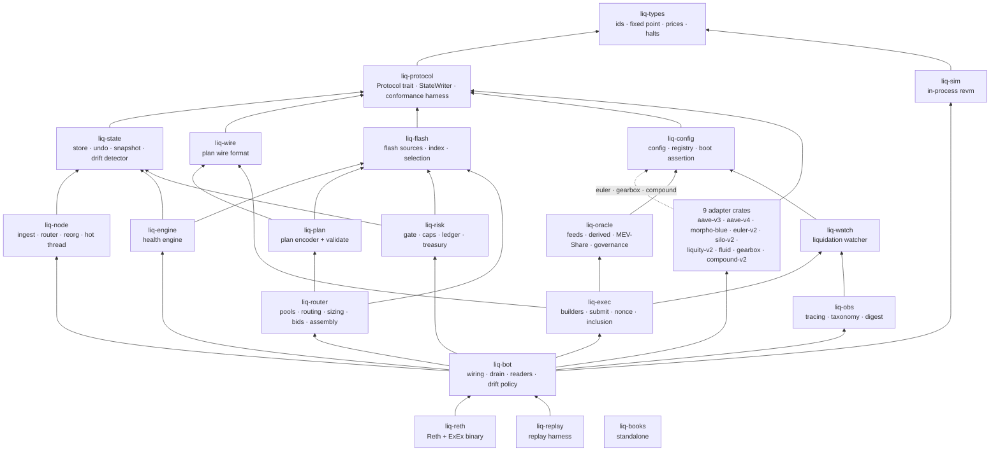

# Liquidation bot

Liquidates under-collateralized positions on Ethereum mainnet lending protocols: Aave V3, Spark, Aave V4, Morpho Blue, Euler V2, Silo V2, Liquity V2, Fluid, Gearbox V3 and Compound V2 forks. It runs inside a Reth node as an execution extension (ExEx), mirrors every tracked account from the node's own logs, and liquidates through the flash-loan-funded `Executor` contract, sending bundles to block builders and MEV-Share.

## Build and run

- **Production** is one process, Reth with the bot as its ExEx. `cargo build --release -p liq-reth --features node` builds the `reth` binary (Linux only: Reth's storage provider does not compile on Windows). `ops/systemd/reth-liq.service` runs it from the repo root, beside Lighthouse (`lighthouse.service`), with `LIQ_RPC_URL` set to the node's own HTTP RPC.
- **First start** builds the state by replaying every tracked log from block 7,710,671 to the node's finalized block, so the node must be fully synced. Later starts resume from the last snapshot.
- **Sending** needs `submit_enabled` (`config/node.toml`, re-read on change or `SIGHUP`), the submit lease and a nonce resync. Without all three the same path runs and only records what it would have sent.
- **Standalone**, without hosting the loop in a node: `cargo build --release -p liq-bot`, run by `ops/systemd/liq-bot.service`.
- **Tests:** `cargo test -p <crate>` for the Rust crates, `forge test` in `contracts/` for the Executor.

Design guides are in [`liquidator-guides/`](liquidator-guides/INDEX.md), per-protocol event coverage in [`docs/coverage/`](docs/coverage/), and protocols deliberately not supported in [`DECLINED.md`](DECLINED.md).

## System map

How the system runs, as built. Each diagram answers one question; read them in order, or jump to the one you need.

1. [The whole system](#1-the-whole-system): what runs where, and what it talks to
2. [Inside the process](#2-inside-the-process-threads-and-what-they-share): threads and what they hand each other
3. [One block, start to finish](#3-one-block-start-to-finish)
4. [How an account is found, tracked and corrected](#4-how-an-account-is-found-tracked-and-corrected)
5. [Drift and resync](#5-drift-and-resync)
6. [From candidate to transaction](#6-from-candidate-to-transaction)
7. [On chain: `Executor.execute(plan)`](#7-on-chain-executorexecuteplan)
8. [Offline jobs and companion processes](#8-offline-jobs-and-companion-processes)
9. [Crate layers](#9-crate-layers)

Boxes are processes, threads or steps; cylinders are stored data; diamonds are decisions. Pieces that are built but not part of the production process are listed at the end, in [Built but not wired](#built-but-not-wired), rather than drawn.

---

### 1. The whole system

Production is one process: Reth with the liquidation loop installed as an ExEx (`liq-reth`, started by `ops/systemd/reth-liq.service`). Every chain read the bot makes goes to that co-located node; a hosted RPC is used only by the daily discovery job.

---

### 2. Inside the process: threads and what they share

One pinned thread, `liq-node-hot`, owns all mutable state: it folds every block, runs the engine and plans liquidations, and never awaits or blocks. Everything slow (chain reads, signing, snapshots, the drift check) runs on its own thread and reaches the hot thread through lock-free rings, published `ArcSwap` values, or the pool book's one lock.

---

### 3. One block, start to finish

A committed block crosses from Reth to the hot thread and is folded before Reth is told it may prune. Planning happens in the same call. Chain reads that logs cannot replace land a moment later, inside the same block's undo record, so a reorg unwinds them with the block.

---

### 4. How an account is found, tracked and corrected

No list of accounts exists anywhere. Contracts are fixed when the adapters bind; an account appears the first time a log names it, and stays current through the same fold on every block. Where logs cannot carry a change, the account is re-read from chain.

---

### 5. Drift and resync

The drift thread compares sampled positions' health with each protocol's own health view, at the protocol's own prices and the snapshot's block. It never halts: wrong state is fixed from chain, and a position whose math still disagrees is kept out of quoting. Probes exist for Aave V3, Spark, Aave V4, Euler and Gearbox; the other protocols are not drift-checked.

---

### 6. From candidate to transaction

Every candidate passes a gate before it is ranked, is sized by the smallest of four ceilings, and, when it acts on committed state, is simulated on the node before it is signed. Sending needs three conditions at once; without them the same path runs and only records what it would have sent. Governance liquidations enter separately, from a simulated payload rather than an engine candidate.

---

### 7. On chain: `Executor.execute(plan)`

The Executor holds funds only in transit. `OPERATOR` (a hot key) can only call `execute`; `PROFIT_SINK` is immutable, and every token leaving the contract other than flash repayments and liquidation repays goes there. The bid is a share of *realized* net, paid to the block's coinbase, so an optimistic quote shrinks the bid instead of the profit.

---

### 8. Offline jobs and companion processes

These run outside the liquidation loop. They decide what the bot watches (the registry and protocol configs) and what the node keeps (the receipts filter), and they measure how the bot does (the watcher, books, digest and replay harness).

---

### 9. Crate layers

Lower crates know nothing of higher ones; the dependency lint enforces the key edges (for example, `liq-engine` never sees an adapter crate, and `liq-protocol` depends only on `liq-types`). Every crate except `liq-books` depends on `liq-types`; those edges are omitted.

---

### Built but not wired

Present in the workspace and tested, but not part of the production process today:

| Piece | Where | State |
|---|---|---|
| In-process revm simulator | `liq-sim`, `DrainJoin::with_sim` | Never attached at startup. Committed-state triggers are simulated on the node instead; triggers that need a pending parent transaction replayed are skipped. |
| Public-mempool ingest | `liq-node` `MempoolProducer`, `liq-oracle` `mempool_oracle` | The rings are created at ExEx install and never fed or read. |
| CEX prices, fusion, aggregator simulation | `liq-oracle` `cex`, `fusion`, `aggsim` | Not referenced by `liq-bot`. Chainlink and derived feeds plus MEV-Share hints price the engine. |
| HTTP alarms (ntfy, Telegram) | `liq-obs` `alert` | Not connected. Alerts, including drift, are log lines. |
| Planned thread layout | `config/cores.toml` | Lists slots such as `liq-oracle-fusion`, `liq-engine-recompute` and `liq-sim-worker-*` that nothing spawns. Only `liq-node-hot` is pinned from it. |
