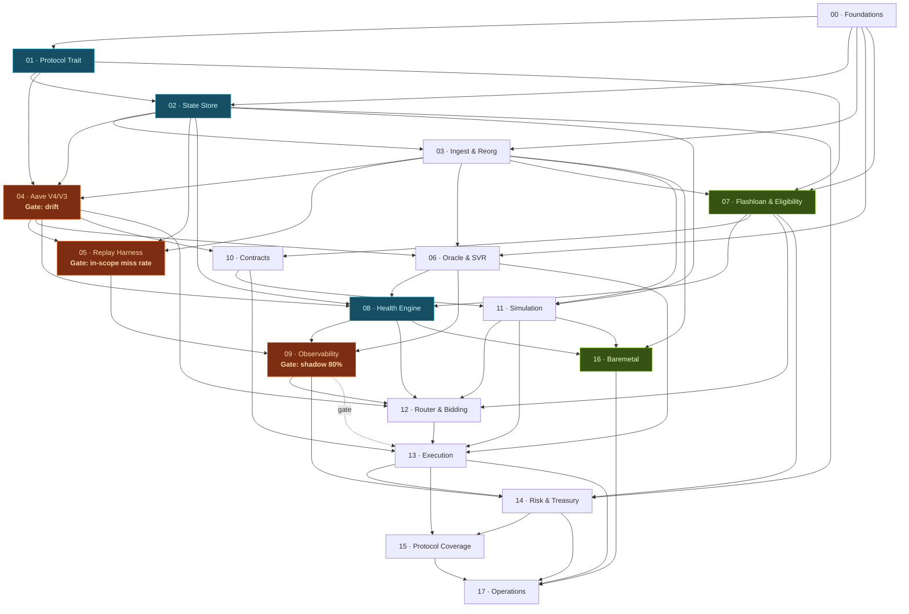

# Multi-Protocol Liquidation System — Engineering Guides

**Scope:** Ethereum mainnet · flashloan-funded only · full protocol universe ·
single baremetal server · Rust + Foundry. Researched September 2026.

Eighteen guides, one per layer, ordered so each is independently verifiable and
expensive infrastructure is only built once justified. Each is self-contained
enough to hand to a single agent or engineer.

**Agent sessions start at [`ORCHESTRATOR.md`](ORCHESTRATOR.md), not here.** That
file plus [`STATE.md`](STATE.md) and [`WORK-PACKAGES.md`](WORK-PACKAGES.md) are
what drive the build: the session protocol, the work-package graph (the dispatch
unit — guides are the *specification*, work packages are what an agent is
handed), the model tier per package, the gate discipline, the PonyTail-HFT
minimal-code pass, and the per-session state that survives a cold start. This
INDEX is the map; the orchestrator is the driver.

**Start with [`PRE-FLIGHT.md`](PRE-FLIGHT.md), before GUIDE 00.** These eighteen
guides describe how to build the system; they do not ask whether the market
supports it. That question is answerable in two weeks with public data and is
otherwise answered in month six by the PnL. It matters more than usual right
now: Chainlink SVR has recaptured $18.3M cumulatively with $8.3M in Q1 2026
alone, holds 99% of oracle-MEV capture, and is spreading beyond Aave to Compound
and others — the oracle-driven share of this opportunity is being deliberately
compressed by the protocols themselves. PRE-FLIGHT maps all nine trigger
classes by whether they are auctioned, shows that only one row is (Aave's SVR
covers ~95% of its OEV-relevant value), and sets out the inputs for the manual
continue/stop decision
down before you are invested.

**Read [`RUST-CONVENTIONS.md`](RUST-CONVENTIONS.md) before writing any code.** It
is the canonical reference for how this system is written: panic and `.unwrap()`
policy, the channel selection matrix (SPSC vs MPSC vs triple buffer vs
`arc-swap`), when a lock is correct and when it is a design smell, allocation
discipline, the `unsafe` policy, and async boundaries. Each guide has its own
**Rust: concurrency & safety** section for the choices specific to its layer.

The single fact that drives all of it: **the hot path is single-threaded,
synchronous, and owns its data exclusively.** `&mut StateStore` is the whole
concurrency story for the part of the system that must be fastest — no `Arc`, no
`Mutex`, no lock-free structure. Everything else communicates by message passing
or published snapshots.

**Read [`DEPENDENCIES.md`](DEPENDENCIES.md) next** — five research findings shape
the design and are referenced throughout:

1. **Aave V4 is live** (30 Mar 2026): dynamic close factor (repay to Target HF)
   and a **variable bonus that scales with health**. "Fire at HF < 1" is no longer
   optimal — when to fire is an EV problem (GUIDE 12).
2. **Aave uses Chainlink SVR**: oracle updates route privately through Flashbots
   MEV-Share and the backrun right is auctioned on value rather than arrival
   order, so **bid quality is a core competency** (GUIDES 06, 12, 13). Latency
   still pays here — it buys decision time before a fixed block deadline, not
   queue position (GUIDE 16 §5) — and it remains decisive for every non-auctioned
   trigger.
3. **Uniswap V4 flash loans are fee-free** and usually deepest after Aave. With
   flashloan-only funding, source selection is a direct bid advantage (GUIDE 07).
4. **Fork multiplier**: Spark is an Aave V3 fork, many mid-tier protocols are
   Compound V2 forks. Target *families*; forks become TOML files (GUIDE 15).
5. **Uniswap V4 is a flashloan source but not a swap venue.** Hooks make swap
   behaviour pool-specific, so there is no generic V4 quote — but hooks do not
   fire on `take`/`settle`, so borrowing is deterministic. Two separate decisions
   about the same contract (GUIDES 07, 12).

**Exact swap math is a first-class dependency.**
[`Dex-Math-Core-rs`](https://github.com/appCryptoCrucible/Dex-Math-Core-rs)
covers V2/V3, Curve StableSwap and Kyber Elastic with
deterministic integer arithmetic. It is not a convenience: split-routing across
concentrated liquidity is impossible without knowing exactly where the marginal
rate jumps at tick boundaries, and **price impact is usually the largest single
cost** in the liquidation (GUIDE 12 Step 4).

**Contract artifacts.** [`Executor.sol`](Executor.sol) is the reference
flashloan executor — one entrypoint, five flashloan providers (id 4 = Sky DSS Flash), split-swap
execution across N pools with the last leg absorbing the remainder,
transient-storage authentication on every callback, and no operator-reachable
way to move funds anywhere but the immutable sink. [`PLAN-ENCODING.md`](PLAN-ENCODING.md) is the packed-calldata
wire format that the Solidity decoder and the Rust encoder must agree on
byte-for-byte, with the mandatory round-trip test. Both belong to GUIDE 10.

---

## The closed loop every liquidation must complete

```
flash-borrow DEBT  →  repay debt, seize COLLATERAL  →  swap COLLATERAL→DEBT
                   →  repay flash + fee  →  keep the remainder
```

Four legs, four size ceilings. A position is a target only if all four are
viable — which makes **flashloan availability a filter on the opportunity
universe**, not an implementation detail. That is why GUIDE 07 is its own crate.

---

## Build order



This is the guide-level picture. At guide granularity most of it is a chain; at
**work-package** granularity (`WORK-PACKAGES.md` §8) three lanes run in parallel
throughout, because the cross-cutting types were moved down to `liq-types` /
`liq-protocol` (D46) and the guides with mixed prerequisites were split (D47).
The `09 -.gate.-> 13` edge is the only gate that blocks *building* anything;
the drift and recall gates block *consumption points* — entering the shadow run,
the first live submission — not code (D49).

---

## The guides

| # | Guide | Crate(s) | Effort | Why it's here |
|---|---|---|---|---|
| 00 | [Foundations](GUIDE-00-foundations.md) | `liq-types` `liq-config` `liq-obs` | 2–3 d | Rounding directions, global `AssetId`, and the cross-cutting types (D46) decided once, forever |
| 01 | [Protocol Trait](GUIDE-01-protocol-trait.md) | `liq-protocol` | 4–5 d | The load-bearing wall. Carries more weight with full-universe coverage |
| 02 | [State Store](GUIDE-02-state-store.md) | `liq-state` | 1–1.5 w | Columnar + undo ring. Reorgs unwind, never resync |
| 03 | [Ingest & Reorg](GUIDE-03-ingest.md) | `liq-node` | 1–1.5 w | Reth ExEx. The node itself is a **day-0 Track A item** (`reth download`, hours) |
| 04 | [Aave V4/V3 Adapter](GUIDE-04-first-adapter.md) | `liq-adapters` | 2–3 w | **Gate:** drift < 1bp for 7 days or nothing downstream matters |
| 05 | [Replay Harness](GUIDE-05-replay-harness.md) | `liq-replay` | 1 w | **Gate:** in-scope miss rate < 30%, every miss classified |
| 06 | [Oracle & SVR](GUIDE-06-oracle-svr.md) | `liq-oracle` | 2–3 w | MEV-Share client, aggregator simulator, derived pricing |
| **07** | [**Flashloan & Eligibility**](GUIDE-07-flashloan-eligibility.md) | `liq-flash` | 1.5–2 w | Five flash arenas (+ cascade ≤3), live liquidity index, universe filter |
| 08 | [Health Engine](GUIDE-08-health-engine.md) | `liq-engine` | 1.5–2 w | Bands, threshold index, time heap. Protocol-blind by lint |
| 09 | [Observability](GUIDE-09-observability.md) | `liq-obs` | 1 w + **4 w running** | **Gate:** shadow mode. Miss taxonomy |
| 10 | [Contracts](GUIDE-10-contracts.md) | `contracts/` | 2–3 w | Five callback shapes × N adapters. Callback auth is the critical bug class |
| 11 | [Simulation](GUIDE-11-simulation.md) | `liq-sim` | 1 w | revm in-process against the node's DB. Highest buy-to-build ratio |
| 12 | [Router & Bidding](GUIDE-12-router-and-bidding.md) | `liq-router` | 3–4 w + ongoing | **Core competency.** Joint repay×seize×source optimization, bid shading |
| 13 | [Execution](GUIDE-13-execution.md) | `liq-exec` | 1.5–2 w | MEV-Share bundles, builder fanout, nonce pool, inclusion watcher |
| 14 | [Risk & Treasury](GUIDE-14-risk-and-treasury.md) | `liq-risk` | 1 w | Halt classes, flash liquidity risk, gas-only treasury, **accounting books** |
| 15 | [Protocol Coverage](GUIDE-15-protocol-coverage.md) | `liq-adapters` | ongoing | The full universe as a program, with a decline list |
| **16** | [**Baremetal**](GUIDE-16-baremetal.md) | `liq-bot` `ops/` | 1–2 w | **New.** NUMA, pinning, hugepages, and how to spend headroom |
| 17 | [Operations](GUIDE-17-operations.md) | `liq-bot` `ops/` | 1–2 w | Failover, runbook, review cadence |

**Effort estimates are developer-hours and assume hand-writing.** Built with
agents the code is days to a couple of weeks; the binding constraint becomes
calendar, not effort — node sync, the 7-day drift gate and the shadow window
mode. See `PRE-FLIGHT.md` §6 for the realistic schedule (~4–6 weeks to first live
submission, most of it waiting) and for why breadth is now cheap enough to build
up front.

---

## The three gates

Hard stops. Passing them in order is what separates a system that makes money
from one that makes confident, wrong, expensive decisions.

| Gate | Guide | Criterion | Why it's absolute |
|---|---|---|---|
| **Correctness** | 04 | Drift < 1 bp across ≥10k positions for 7 days, per adapter | A bot with silently-wrong state doesn't fail loudly. It stops winning, and you find out from the PnL months later. |
| **Recall** | 05 | ≥50 in-scope observations, miss rate < 30% aggregate **and per coverage row**, 100% of misses classified, `declined` classified | A position you never flagged cannot be won by any execution tuning — but not every liquidation was worth having. The denominator is in-scope; the classifier must use fork calls, not our own state. |
| **Shadow** | 09 | Intended submission precedes the winner's inclusion in >80% of opportunities, over ≥2 weeks and ≥200 contested opportunities | If you can't beat them on paper with zero risk, you won't beat them with capital at stake. |
| **Supervised** | 17 §0 | All six rows of GUIDE 17 Step 0, over ≥10 watched sessions and ≥2 weeks, ≥3 in a volatile period | The first time capital is at risk unattended. Everything before this was reversible. |

---

## What flashloan-only funding changes

It is not a funding detail — it reshapes four layers:

- **Adds GUIDE 07.** Flash liquidity is tracked live, per asset per source, and
  gates which positions are targets at all. `Band::Unfundable` is a real state.
- **Changes sizing (GUIDE 12).** The binding constraint is usually flash depth or
  route depth, rarely the protocol's close factor. Partial liquidations that land
  beat full ones that revert.
- **Changes the contracts (GUIDE 10).** Five callback shapes, one dispatching
  executor. **Every callback must validate `msg.sender` and the initiator** —
  that is the characteristic vulnerability of this design.
- **Shrinks risk (GUIDE 14).** No inventory, no capital allocator, no warehoused
  collateral to mark. What replaces it is flash *liquidity* risk: dependence on
  pools you do not control. Treasury is gas plus unswept profit, nothing more.

And it makes the fee an unavoidable line item, which is why a zero-fee source is
a bid advantage rather than a nicety.

---

## Running the build

| File | Role |
|---|---|
| [`ORCHESTRATOR.md`](ORCHESTRATOR.md) | Session protocol, dispatch rule, model routing, review protocol, PonyTail-HFT, gate discipline. **Every agent session reads this first.** |
| [`WORK-PACKAGES.md`](WORK-PACKAGES.md) | The acyclic build graph: every work package with its spec sections, owned paths, dependencies, tier → reviewer, and the acceptance lines it owns. **The dispatch unit.** |
| [`STATE.md`](STATE.md) | Live progress per work package, claims, gate evidence, decision log. The handoff between cold sessions. |
| [`AGENT-OPS.md`](AGENT-OPS.md) | The agent that **operates** the system once built, run as an experiment. Phases, authority, invariants, measurement. Not a build document. |
| [`TESTING.md`](TESTING.md) | What each test must **prove**, the oracle its expected value may come from, and the plausible fake version of it. Read before writing any test. |
| [`REGISTRY.md`](REGISTRY.md) | Addresses, decimals, token ordering and fee tiers — derived on-chain, verified three ways, asserted at every boot. Generate day 0; it feeds D15's prune filter. |
| [`PRE-FLIGHT.md`](PRE-FLIGHT.md) | Whether to build it, phase-1 scope, inputs for the manual continue/stop call |
| [`RUST-CONVENTIONS.md`](RUST-CONVENTIONS.md) | How everything is written |
| [`DEPENDENCIES.md`](DEPENDENCIES.md) | Bought vs. built, with the research behind it |
| [`PLAN-ENCODING.md`](PLAN-ENCODING.md) | **The single source of truth for the executor's calldata layout.** Byte offsets, encoder invariants, the round-trip test. Read with `Executor.sol`, never apart from it |
| [`Executor.sol`](Executor.sol) | The on-chain contract. Immutable once deployed, so every wire-format question is settled before GUIDE 10 |
| `INDEX.md` | This map |
| [`CHANGES.md`](CHANGES.md) | What moved and why, across the reshapes |
| [`RESEARCH-NOTES.md`](RESEARCH-NOTES.md) | Citation scratch for flash-availability formulas and enumeration recipes (Round 23) |

The 18 numbered guides (`GUIDE-00` … `GUIDE-17`) are listed in the sequence table
above. Those files plus `PLAN-ENCODING.md`, `Executor.sol`, `RESEARCH-NOTES.md`,
`D15-ADDRESSES.md`, `D15-COMPLETION.md` (generated report of the D15 completion
pass) and `WORK-PACKAGES.md` are everything that is not a numbered guide —
**34 files** in total. `D15-ADDRESSES.md` → "Completeness" defines what the
prune filter must contain; `d15_receipts_log_filter.complete.toml` is the file
H1 signs.

**Three tracks run concurrently**, and two of them are wall clock rather than
work — start them on day 0, before WP 00A:

- **Track A** OS → prune profile (H1) → `reth download` → watcher live → the
  7-day drift week per adapter → the shadow window (≥2 weeks and ≥200 contested
  opportunities) → the supervised live window
- **Track B** the work packages, by eligibility (`ORCHESTRATOR.md` §4)
- **Track C** registry discovery → verification → prune filter → local log
  extraction; market study on the side, feeding H2 only

An agent that finds Tracks A/C unstarted does C1–C3, gets H1, starts A1–A2, and
only then opens Track B. Everything that touches the node blocks on having one —
hours via `reth download`, days if you sync from genesis, which you should not —
and the prune profile (GUIDE 16 Step 0b) must be settled before that sync starts,
because Reth prunes as it goes and the decision cannot be revisited afterwards.
The foundations (00A–00C, 01, 02A, 03A) need no node and run while it downloads.

## Guide format

Every guide has the same structure, so an agent can be handed any one cold:

**Header table** (crate, prerequisites, effort, what it blocks) → **Objective** →
**Build vs. buy** for that layer → **Numbered steps** with type signatures and
file paths → **Rust: concurrency & safety** for the primitives that layer needs →
**Acceptance criteria** as a verifiable checklist → **Failure modes** as
symptom → cause → **Handoff** naming what must not be skipped.

---

## The one structural rule

`liq-engine` must never depend on `liq-adapters`. Enforced by a CI lint added in
GUIDE 00, before there is anything to lint. Adding a protocol must be a new crate
and a TOML file — never a change to the engine.

GUIDE 15 is where you find out whether you got it right. If adding Morpho Blue
requires touching `liq-engine`, stop and fix the trait. That is the signal the
entire abstraction exists to produce, and with a dozen protocols ahead of you it
is worth stopping for.
